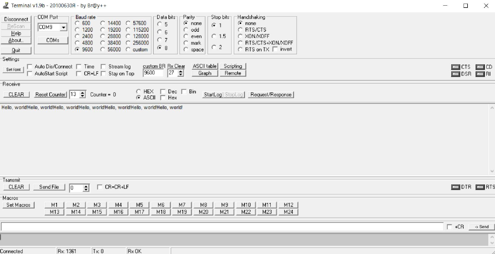

=== _Задание_:

Отправлять фразу "Hello world!" раз в секунду по USART.

=== _Выполнение задания_:

Реализовано это так, создается обертка для USART - UsartDriver. Он
взаимодействует непосредственно с железом и вызывает необходимые методы
USART.(Рисунок архитектуры остался в университете)

Для реализации программы в UsartDriver созданы методы для считывания
сообщения по байтно и отправке его.

Код программы представлен ниже.

=== _Код программы UsartDriver

----
#pragma once
#include "itransmit.h"
#include <cassert>
#include <array>

template<typename TUsart>
class UsartDriver: public ITransmit
{
private:
  uint8_t transmitBuffer[255];
  size_t size = 0U;
  uint8_t i = 0U;

public:
  void SendMessage(const char* message, size_t aSize)
  {
    assert(size<=255);
    memcpy(transmitBuffer, message, aSize);
    size = aSize;
    i=0U;
    TUsart::WriteByte(transmitBuffer[i++]);
    TUsart::EnableTransmit();
    TUsart::InterruptEnable();
  }

  void OnNextByteTransmit()
  {
    TUsart::WriteByte(transmitBuffer[i++]);
    if (i>=size)
    {
      TUsart::DisableTransmit();
      TUsart::InterruptDisable();
      i=0U;
    }
  }

};
----

=== _Код программы Usart

----
#pragma once
#include <cstdint>
#include "itransmit.h"
#include "usart2registers.hpp"
#include "usartdriver.h"

template<typename TUSARTReg, auto& aTransmitter>

class Usart
{
private:
  inline static ITransmit& transmitter = aTransmitter;

public:
  static void WriteByte(std::uint8_t byte)
  {
    TUSARTReg::DR::Write(byte);
  }
  static void InterruptHandler()
  {
    if(TUSARTReg::SR::TXE::DataRegisterEmpty::IsSet() && TUSARTReg::CR1::TXEIE::InterruptWhenTXE::IsSet())
      {
        transmitter.OnNextByteTransmit();
      }
  }
  static void EnableTransmit()
  {
    TUSARTReg::CR1::TE::Enable::Set();
  }
  static void DisableTransmit()
  {
    TUSARTReg::CR1::TE::Disable::Set();

  }
  static void InterruptEnable ()
  {
    TUSARTReg::CR1::TXEIE::InterruptWhenTXE::Set();
  }
  static void InterruptDisable ()
  {
    TUSARTReg::CR1::TXEIE::InterruptInhibited::Set();
  }
};
----

=== _Код программы UsartConfig

----
#pragma once
#include "usartDriver.h"
#include "usart.h"
#include "usart2registers.hpp"

class MyUsart;

inline UsartDriver<MyUsart> usartDriver;

class MyUsart : public Usart<USART2, usartDriver>
{
};
----

=== _Код программы ITransmit

----
#pragma once

class ITransmit
{
public:
  virtual void OnNextByteTransmit() = 0;
};

----

=== _Код программы main

----
#include "rccregisters.hpp"
#include "gpioaregisters.hpp"
#include <iostream>
#include <bitset>
#include "nvicregisters.hpp"
#include "tim2registers.hpp"
#include "usart.h"
#include "usartconfig.h"

extern "C"
{
  int __low_level_init(void)
  {
    RCC::CR::HSEON::On::Set();
    while(!RCC::CR::HSERDY::Ready::IsSet())
    {
    }

    RCC::CFGR::SW::Hse::Set();
    while(!RCC::CFGR::SWS::Hse::IsSet())
    {
    }
    RCC::CR::HSION::Off::Set();

    RCC::AHB1ENR::GPIOAEN::Enable::Set();
    GPIOA::MODER::MODER3::Alternate::Set(); // TX
    GPIOA::MODER::MODER2::Alternate::Set(); //RX
    GPIOA::AFRL::AFRL2::Af7::Set(); // ôóíêöèÿ àëüòåðíàòèâíîãî ïîðòà
    GPIOA::AFRL::AFRL3::Af7::Set();
    GPIOA::OTYPER::OT2::OutputPushPull::Set();
    GPIOA::OTYPER::OT3::OutputPushPull::Set();
    GPIOA::PUPDR::PUPDR2::PullUp::Set();
    GPIOA::PUPDR::PUPDR3::PullUp::Set(); // ìóòü ñ ïîðòàìè

    RCC::APB2ENR::ADC1EN::Enable::Set();
    RCC::APB1ENR::USART2EN::Enable::Set(); // òàêòèððîâàíèå

    USART2::CR1::M::Data8bits::Set(); // 8 áèò äëèíà
    USART2::CR1::PCE::ParityControlDisable::Set(); // ÷åòíîñòü
    USART2::CR1::OVER8::OversamplingBy16::Set(); // äèñêðåòèçàöèÿ 1/16
    USART2::CR2::STOP::Value0::Set(); //1 ñòîï áèò
    USART2::BRR::Write((8'000'000/(9600*8*2) << 4U)); //ñêîðîñòü
    USART2::CR1::UE::Enable::Set(); //âêëþ÷åíèå
    USART2::CR1::TE::Enable::Set();

    NVIC::ISER1::Write(1<<6);

    RCC::APB1ENR::TIM2EN::Enable::Set();

    TIM2::PSC::Set(7999U);
    TIM2::ARR::Write(1000);
    TIM2::SR::UIF::NoInterruptPending::Set();
    TIM2::CNT::Write(0U);
    TIM2::CR1::CEN::Enable::Set();

    return 1;
  }
}

int main()
{

  const char* message = "Hello, world! \n" ;

  for (;;)
  {
    usartDriver.SendMessage(message,strlen(message));
    while (!TIM2::SR::UIF::InterruptPending::IsSet());
    TIM2::SR::UIF::NoInterruptPending::Set();

  }
  return 0;
}
----

=== _Результат работы программы

